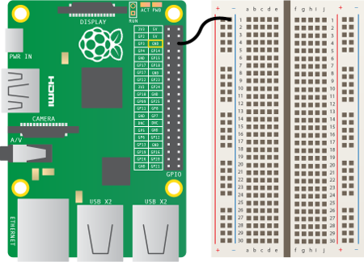
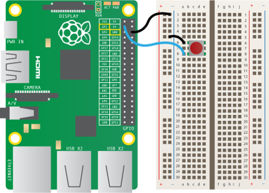
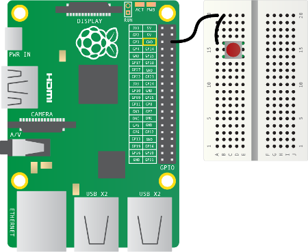

# Connecting a push button

A push button will complete a circuit when the button is pressed.  What that means is that a current will not flow across the button until it is pressed.  When it is released, the circuit will be ‘broken’.

Firstly, observe the following GPIO diagram. You'll be using a single ground pin (marked `GND`) and several GPIO pins (marked `GPIO`):

|            |            |
|-----------:|:-----------|
|    3V3     | 5V         |
|  **GPIO2** | 5V         |
|  **GPIO3** | GND        |
|  **GPIO4** | **GPIO14** |
|        GND | **GPIO15** |
| **GPIO17** | **GPIO18** |
| **GPIO27** | GND        |
| **GPIO22** | **GPIO23** |
|        3V3 | **GPIO24** |
| **GPIO10** | GND        |
|  **GPIO9** | **GPIO25** |
| **GPIO11** | **GPIO8**  |
|        GND | **GPIO7**  |
|        DNC | DNC        |
|  **GPIO5** | GND        |
|  **GPIO6** | **GPIO12** |
| **GPIO13** | GND        |
| **GPIO19** | **GPIO16** |
| **GPIO26** | **GPIO20** |
|        GND | **GPIO21** |

Note that if you have an older Raspberry Pi model you'll only have 26 pins but they have the same layout, starting at the top row (`3V3` and `5V` and ending at `GND` and `GPIO7`).
    
1. Find a ground pin (marked `GND`) on the diagram of the Raspberry Pi's pin layout above.

1. Attach a wire to a ground pin on the Raspberry Pi and connect it to the ground rail on your breadboard like so:

    

1. Place the button on the breadboard and connect one of its feet to the ground rail.

1. Connect the button's other foot (on the same side) to GPIO pin 2 like so:

    
    
    If you're using a mini breadboard without a designated ground rail, you'll have to use one of the rows as the ground rail. Connect a row to a ground pin and the other points in that row will be connected to ground like so:

    

[Back to getting started with physical computing](worksheet.md)
