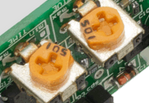

## Test the PIR motion sensor in Python

We're going to use the Python programming language to write some code that will detect movement and print out some text; we can extend the program to involve the camera board later on. When movement is detected the PIR motion sensor applies power to its OUT pin, which we have connected to GPIO pin 4 on the Pi. So in our code we just need to continually check pin 4 to see if it has power or not.

If a pin has power we call it HIGH and if not we call it LOW.

The program is pretty simple. We will first set up the Raspberry Pi GPIO pins to allow us to use pin 4 as an input; it can then detect when the PIR module sends power. We need to continually check the pin for any changes, so a `while True` loop is used for this. This is an infinite loop so the program will run continuously unless we stop it manually with `Ctrl + C`.

We then use two Boolean (True or False) variables for the previous and current states of the pin, the previous state being what the current state was the preceding time around the loop. Inside the loop we compare the previous state to the current state to detect when they're different. We don't want to keep displaying a message if there has been no change.

Firstly create a blank Python file with the following command:

```bash
nano pirtest.py
```

Enter or copy and paste the code below:

```python
import RPi.GPIO as GPIO
import time

sensor = 4

GPIO.setmode(GPIO.BCM)
GPIO.setup(sensor, GPIO.IN, GPIO.PUD_DOWN)

previous_state = False
current_state = False

while True:
    time.sleep(0.1)
    previous_state = current_state
    current_state = GPIO.input(sensor)
    if current_state != previous_state:
        new_state = "HIGH" if current_state else "LOW"
        print("GPIO pin %s is %s" % (sensor, new_state))
```

Press `Ctrl + O` to save and `Ctrl + X` to quit.

Now run the Python file:

```bash
sudo python3 pirtest.py
```

If you get an error saying `RuntimeError: No access to /dev/mem` it means you forgot to use `sudo`. You must run programs that access the GPIO as root and `sudo` does this for you; to help remember you can think of it as 'super-user-do'.

If you start moving or waving the sensor pin will go HIGH. Keep on waving and it will stay HIGH, and only go back to LOW if you keep still again. If you see the sensor behave like this, then everything is working correctly. If not, something is wrong and you need to go back and troubleshoot.

```
GPIO pin 4 is HIGH
GPIO pin 4 is LOW
GPIO pin 4 is HIGH
```

Press `Ctrl + C` when you want to exit.



On the PIR module you should see two orange components with sockets that fit a Phillips screwdriver (see above). These are called *potentiometers*, and they allow you to adjust the sensitivity of the sensor and the detection time. I would suggest setting the sensitivity to max and the time to min, but the choice is yours.

[Back to getting started with physical computing](worksheet.md)
